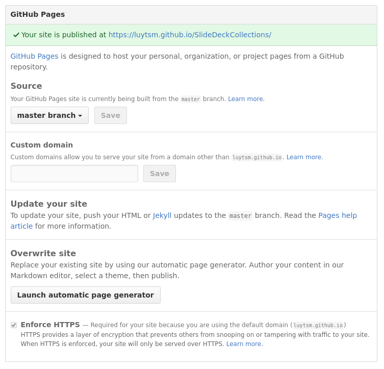

# Slide Deck Collections
Jekyll template to host multiple reveal.js slide decks on GitHub Pages 

Based upon:
[jekyll-reveal](https://github.com/jens-na/jekyll-reveal)

## Usage

* Install ruby with package manager
* Install the bundler gem
```shell
gem install bundler
```
* Clone with recursive switch:  
```shell
  git clone --recursive https://github.com/luytsm/SlideDeckCollections
```
* Navigate into directory and install the necessary gems with bundler 
```shell
cd SlideDeckCollections
bundle install 
```
* Add slides in `_slides` folder. Only add reveal.js `<section>` 
* To run locally start jekyll with following command
```shell
bundle exec jekyll serve --baseurl ''
```
* To publish to github  
  * Create new repo on github
  * Change baseurl in `_config.yml`
  * push cloned repo to github

```shell
git remote add <remote_name> <link_to_new_github_repo>
git push -u <remote_name>
```
* Enable GitHub Pages on the setting page (Set master branch as source)



